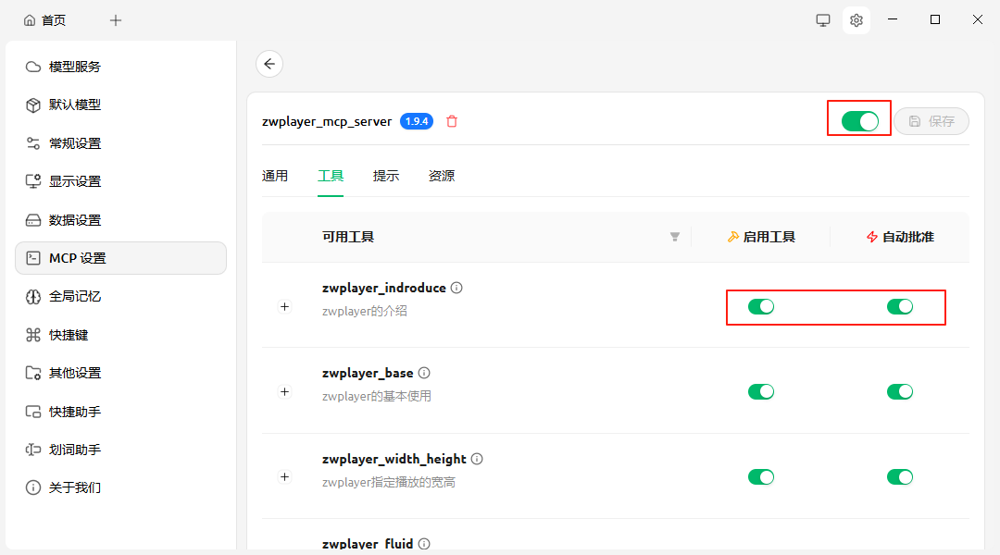

# **MCP Server 启动和应用** 
**MCP**（全称为 **Model Context Protocol**，即“模型上下文协议”）通过提供统一的通信标准，实现了AI模型与工具/数据源之间的解耦。

本文将分享一个基于**可流式HTTP协议** 的MCP服务开发与接入实践。在该实践中，我们以**Cherry Studio**作为MCP客户端，通过配置大语言模型，实现了对话交互与MCP工具的调用。

MCP还有stdio协议，那个不适合于企业级应用，还有原来的SSE协议已经被streamable HTTP取代了，所以这里只讲基于**可流式HTTP协议** 的MCP服务开发与接入实践。

本文开发的MCP服务是一个示例，它封装了一个网页播放器(zwplayer)的各项设置功能作为工具集，这个zwplayer播放器简单易用，不依赖插件，适合作为示例。当然，您可以将其中的工具函数替换为任何其他功能，本示例仅旨在演示完整的开发与集成流程。

## **一、MCP服务**

本zwplayer mcp 服务，是一个基于mcp组件的MCP 服务。

conda activate qaanthing
#cd /home/data/cdy/zwplayer_mcp_server/src
python -m zwplayer_mcp_server

具体源码参见：https://github.com/chendanyu/zwplayer_mcp_server

其中关于zwplayer 网络播放器的具体用法，参见：https://www.zwplayer.cn

# **二、Cherry Studio 设置 **

### 2.1.MCP设置

点击右上角的齿轮图标，点击左侧菜单项的“MCP设置”，如下图所示：

名称：zwplayer_mcp_server

类型：可流式传输的HTTP(streamableHttp)
URL: http://127.0.0.1:8000/mcp

或者其它正确的mcp服务器，默认8000端口。

点击右上角的那个启用按钮，启用该mcp服务器。点击工具，可以看到该服务器对外提供的工具：

### 2.2.大语言模型配置

 我们以deepseek为例：

选择模型服务，选择深度求索，输入API密钥，此密钥从https://platform.deepseek.com/api_keys获取。

把默认的硅基流动的模型取消掉。

### 2.3.工具调用

在对话框，选择要用的mcp服务。

然后输入提示词，比如：麻烦你给我介绍一下zwplayer

